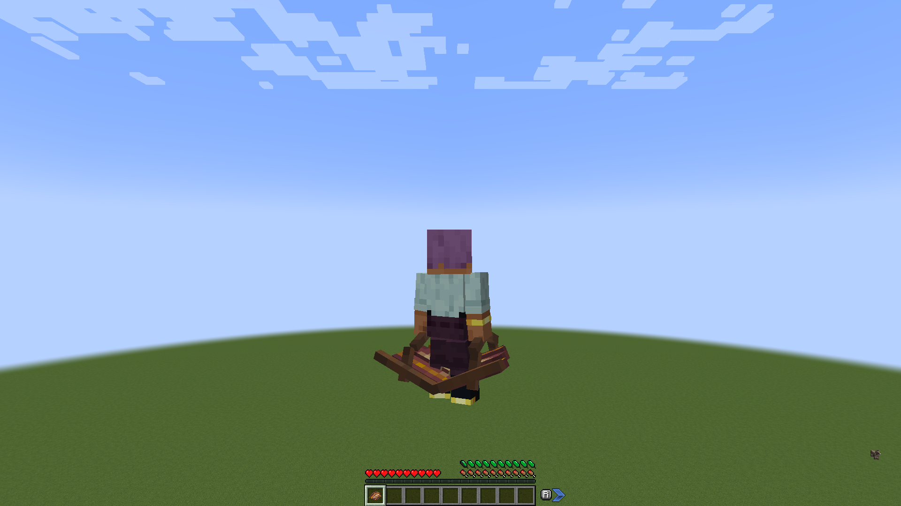
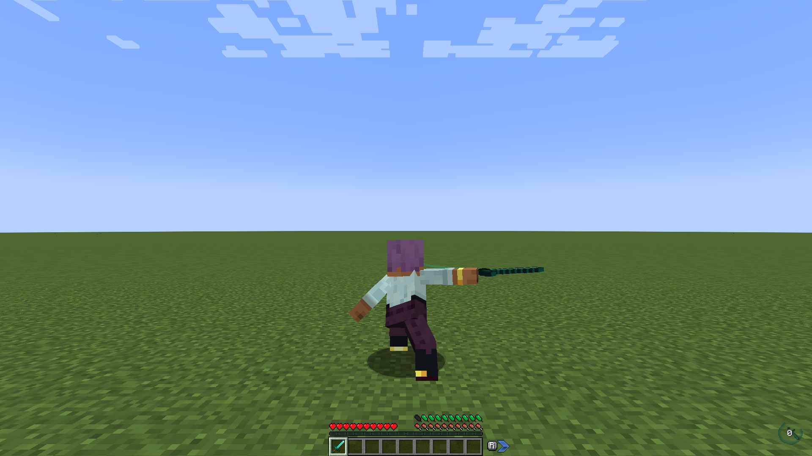
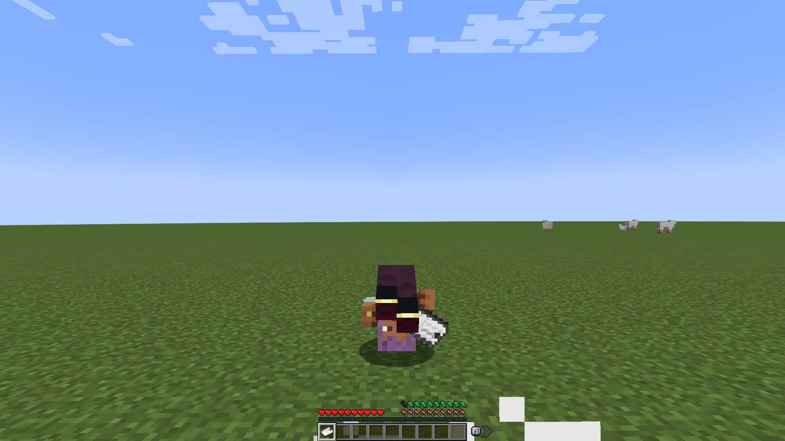
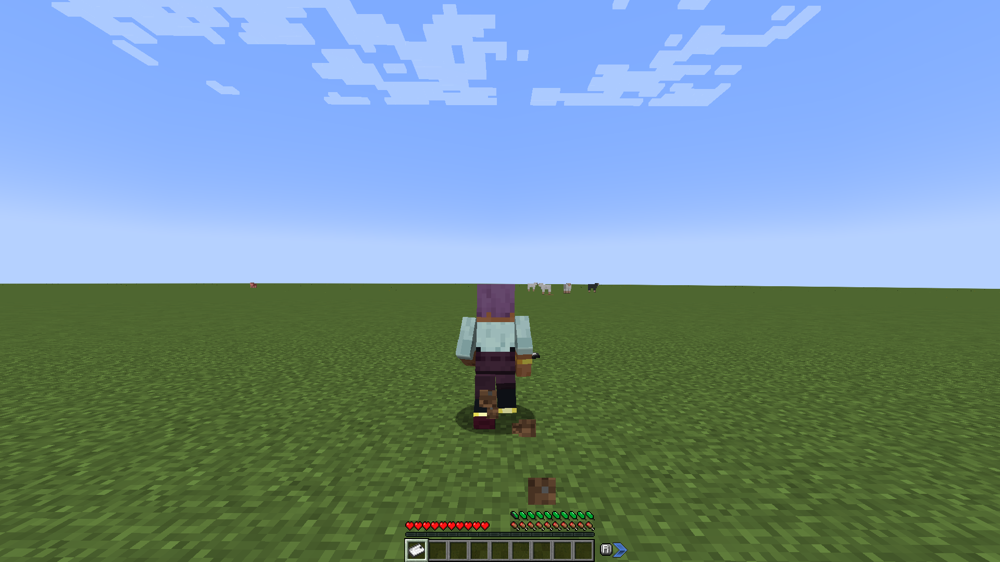
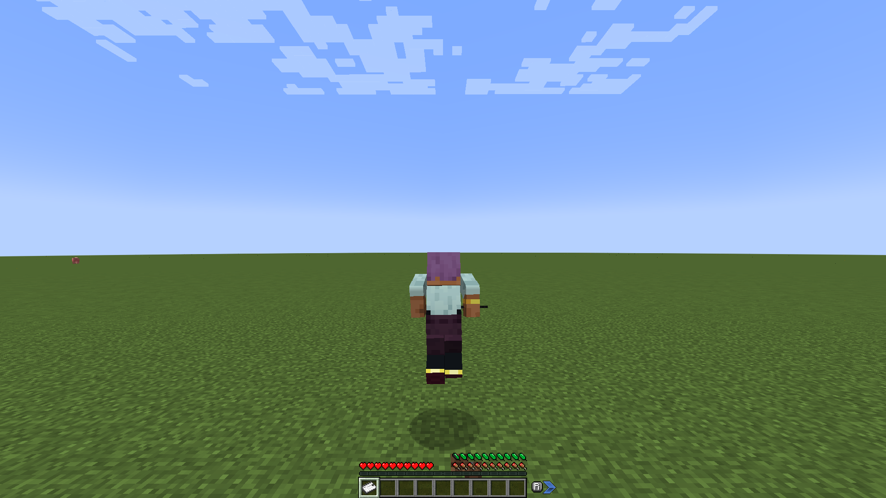

# Compatibility

Every compatibility is optional and only active when that mod is installed. Each has its own section in the config, with an `enabled` switch.

## Paragliders

Paragliding drains AoS stamina, and Paragliders reads its stamina from AoS. Its stamina wheel is hidden, and its own stamina logic is turned off. Because of that, Paragliders never charges running or swimming. AoS's sprint and swim actions charge them instead. With `paragliders.enabled = false`, Paragliders keeps its own stamina wheel.

Stamina Vessels (traded for Spirit Orbs at a goddess statue) make the AoS bar larger, as they would make Paragliders' wheel larger: each vessel adds `feathers_per_vessel` max feathers (2 by default, 0 turns this off). With Feathers of Fatigue it is a `max_feathers` attribute modifier, `actionsofstamina:paragliders/stamina_vessels`; with the internal stamina the bar itself grows. It is set when you join, respawn or change dimension, and whenever the number of vessels changes. With `paragliders.enabled = false` the vessels only count for Paragliders' own wheel.

## Better Combat

Every Better Combat weapon swing costs stamina. The server charges each swing when Better Combat's attack request arrives, and drops a swing it can't pay for. The client cancels a swing you can't afford as soon as its upswing starts. You can tune the cost with multipliers for two-handed weapons, off-hand swings and the last swing of a combo. Weapons that Better Combat swings use this cost instead of the vanilla attack cost.

Each swing's cost is also multiplied by the weapon's Better Combat category (`category_multipliers`, entries like `"claymore=1.2"`): by default daggers, fists, claws, sickles, rapiers and spears cost less, axes, claymores, hammers, maces and anchors more, and any category not listed costs the base amount. The category multiplier stacks with the two-handed, off-hand and combo-finisher ones. It is worked out once per weapon type and worked out again when the config or the datapacks reload.

## Combat Roll

Each roll costs stamina. A roll isn't available on the client while you can't pay for it.

## Wall-Jump TXF

Wall jumps and double jumps cost stamina, and clinging to a wall (and sliding down it afterwards) drains it. A jump you can't pay for doesn't happen, you can't grab a wall without the stamina to begin, and you let go of the wall when you can't pay any more. Wall-Jump TXF decides these moves on the client, so the client refuses them and the server charges them.

## Other mods' wings, shields and weapons

Wings from other mods cost stamina only when a datapack adds them to the item tag `actionsofstamina:stamina_wings` (it holds the vanilla elytra). Mechanical or propelled wings are free by default: the tag is for wings you flap or glide with yourself. They cost when worn in the chest slot, or, with Curios installed, in any curio slot (mods that give the elytra its own slot).

Shields from other mods cost like the vanilla shield, as long as they block like one (the `minecraft:blocks_attacks` component, which every item that blocks attacks has). They count in either hand.

Bows, crossbows and tridents from other mods cost like the vanilla ones when they use the same use animation (drawing a bow, loading a crossbow, aiming a trident). Spears are not drawn: holding one ready is free, and their stabs cost like any attack. Throwables from other mods cost only when a datapack adds them to the item tag `actionsofstamina:throwables`.

With `vanilla.attack.also_for_non_weapons = false`, an item is a weapon when it adds attack damage in the main hand, however it gets it: its own attribute modifiers, ones worked out for that very stack, or ones added by other mods through NeoForge's attribute modifier event. Modular weapons that build their damage from their parts (as Tetra's do) count as weapons.

## Curios

Stamina wings (the item tag `actionsofstamina:stamina_wings`) worn in a curio slot cost stamina like wings in the chest slot. The server notices when they are put on or taken off; the client checks once a second.

## Versions

Actions of Stamina calls into these mods directly, so it accepts the versions it was tested with, up to the next major version. With a version outside that range, the game stops at load and names the mod and the range, instead of crashing later in the middle of play.

| Mod | Accepted versions (26.2) |
|---|---|
| Paragliders | 26.2 up to 26.3 |
| Better Combat | 3.2 up to 4 |
| Combat Roll | 3.0 up to 4 |
| Wall-Jump TXF | 26.2-1.3 up to 26.3 |
| Curios | 16.0.0 up to 17 |
| Feathers of Fatigue | 26.2-1.0.0 up to 26.2-2 |

## On Minecraft 1.21.1 and older

ParCool, Epic Fight, Gliders and Create have no build for Minecraft 26.x, so their compats are only in Actions of Stamina for Minecraft 1.21.1 and older. [Minecraft Versions](Minecraft-Versions) lists what each version supports and was tested with.

### ParCool

All 24 ParCool actions (fast run, wall run, vault, dodge, hang on, climb up, slide, dive, breakfall, charge jump, ...) cost stamina. Each action has its own start cost, per-second drain, finish cost and regeneration delay. The defaults are ParCool's own costs, scaled to a 20-feather bar.

AoS charges on the server when ParCool starts, ticks and finishes an action. It stops an action from starting or continuing when the stamina is short. While ParCool's fast run, fast swim or crawl is active, AoS's own sprint, swim and crawl costs stay out, so they aren't charged twice.

AoS registers its own ParCool stamina type, `actionsofstamina:stamina`. It shows ParCool the AoS stamina (so ParCool knows when you are exhausted), ignores ParCool's own costs and regeneration (AoS charges the actions, so nothing is charged twice), and hides ParCool's stamina HUD. There is nothing to set up: it is the default `stamina_type` of a new ParCool server config, and while `parcool.enabled = true` it also replaces ParCool's own `parcool:parcool`, which existing configs hold. `parcool:none` works too. Any other type (`parcool:hunger`, Epic Fight's) charges the actions a second time, and AoS logs a warning at server start. With `parcool.enabled = false`, AoS's stamina type behaves exactly like ParCool's own.

### Epic Fight

Epic Fight skills in the dodge, guard, weapon innate and mover categories spend AoS stamina instead of Epic Fight stamina. Guards are charged once per blocked hit. A skill you can't pay for fails, the same as it would without Epic Fight stamina. Skills in other categories still use Epic Fight's own stamina.

In Epic Fight's battle mode, each swing of its basic attack combo costs stamina, and the vanilla attack cost stands aside so a swing is only charged once. Swings you can't pay for don't happen.

### Gliders

Gliding with a deployed glider drains stamina, since you hold on to it. You can't deploy a glider without the stamina to begin, and the glider folds when the stamina runs out.

### Create

Turning a hand crank (holding the use key on it) drains stamina for as long as you keep it turning, as does turning a valve handle (`create.crank.valve_handles`). A crank you can't afford doesn't turn, and one you are turning stops when the stamina runs out. Create's own hunger cost for cranking still applies.
