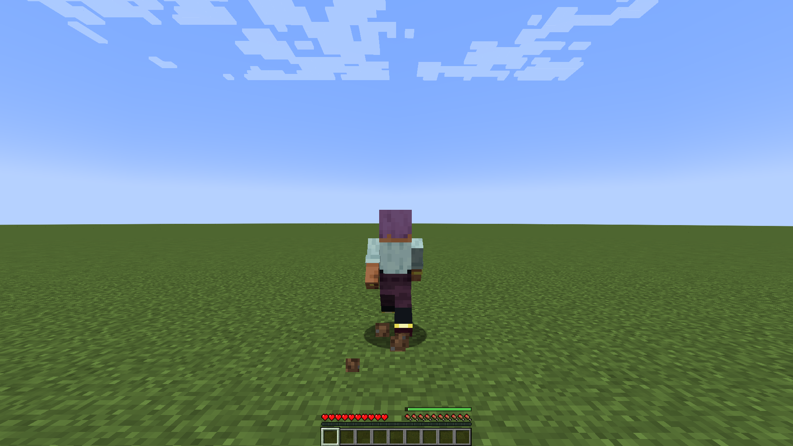

# Stamina Backends

| Backend | When | What you get |
|---|---|---|
| **Feathers of Fatigue** | Feathers of Fatigue (1.0.1 or later, for the same Minecraft version) is installed, and `backend` is `AUTO` or `FEATHERS` | The feathers, regeneration, strain, exhaustion, effects, armor weight, climate and HUD of Feathers of Fatigue. AoS spends under its own sources (`actionsofstamina:sprint`, `actionsofstamina:walljump/wall_jump`, ...). |
| **Internal** | Feathers of Fatigue is not installed, or `backend = INTERNAL` | A small, light bar: a maximum, regeneration after a short delay, and exhaustion. After you run out, you must get back part of the bar before you can act again. The bar shows as a thin line above the food bar. |

The server selects the backend when it starts and tells each client which one it uses. Feathers of Fatigue is an **optional** dependency. AoS works without it.

Feathers of Fatigue has a basic exertion of its own: sprinting and jumping cost feathers. With AoS installed, AoS charges those actions, so it turns that basic exertion off through the Feathers of Fatigue API, with either backend. A player never pays twice for a sprint or a jump. This is why AoS needs Feathers of Fatigue 1.0.1 or later (26.1.2-1.0.2 on 26.1.2, 26.3-1.0.0-beta.2 on 26.3).

Creative and spectator players never spend stamina.

*Without Feathers of Fatigue: the own thin bar of AoS above the food bar.*
