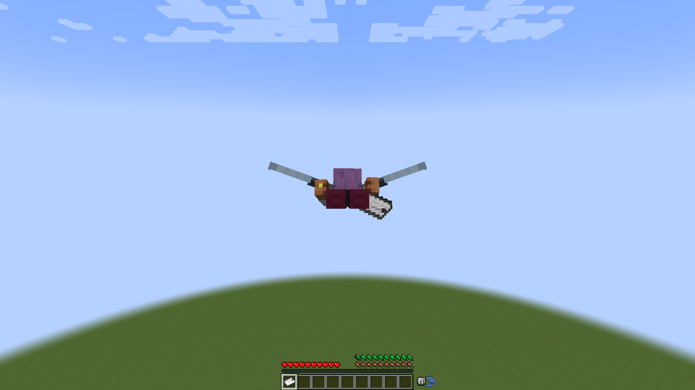
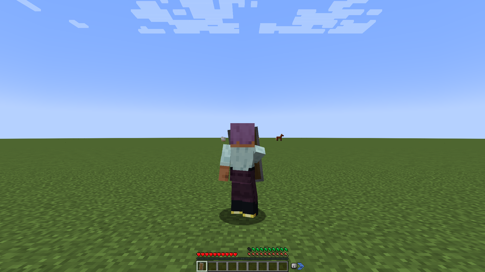

# Vanilla Actions

| Action | How it costs | Default |
|---|---|---|
| Sprinting | Drain while sprinting; blocks regeneration | 0.25 feathers/s, 2 needed to start |
| Swimming (fast swim) | Drain while swimming | 0.5 feathers/s |
| Elytra flying | Drain while gliding, free while a firework rocket boosts you | 0.05 feathers/s, 2 needed to start |
| Crawling | Drain while moving in the crawl pose on land; you move slower when you can't pay | 0.1 feathers/s |
| Holding up a shield | Cost to raise it, then a drain | 1 feather, then 0.2/s |
| Jumping | Charged once every few jumps | 1 feather every 4 jumps |
| Attacking | Charged once every few attacks | 1 feather every 3 attacks |
| Drawing a bow, loading a crossbow, aiming a trident | Cost to start, then a drain while drawn | 0.5 feathers, then 0.5/s |
| Throwing (snowball, egg, ender pearl, splash or lingering potion, wind charge, trident) | Charged per throw | 0.5 feathers |
| Mining (off by default) | Charged once every few blocks, scaled by the block's hardness | 0.1 feathers × hardness every 4 blocks |
| Building (off by default) | Charged once every few blocks placed | 0.1 feathers every 4 blocks |
| Climbing (off by default) | Drain while going up a ladder, vines, scaffolding or anything climbable | 0.3 feathers/s, 1 needed to start |
| Rowing (off by default) | Drain while you paddle or turn a boat you drive | 0.15 feathers/s, 1 needed to start |
| Riptide launch (off by default) | Charged per launch | 1 feather |
| Fishing (off by default) | Charged per cast and per reel | 0.25 feathers |
| Tilling, making paths, stripping logs, scraping copper (off by default) | Charged once every few blocks | 0.25 feathers every 2 blocks |
| Brushing (off by default) | Drain while brushing | 0.2 feathers/s |
| Mace smash | Charged on its own, at a multiple of the attack cost | 2 feathers |

Sprinting and swimming need the stamina to begin (`min_stamina`), as sprinting needs food: holding the sprint key without it does nothing until the stamina is back, and they stop when it runs out.

Attacks with non-weapons (bare hands, tools without attack damage) are free unless `also_for_non_weapons = true`.
By default only attacks that hit an entity are charged (`only_for_hits`); with it off, swings at the air count like hits towards the charge.

Without the stamina for an attack, the attack is cancelled: no swing, no hit (`exhausted_mode = "CANCEL"`). With `exhausted_mode = "WEAKEN"` it lands anyway, but weakened: while your stamina is short, your attack damage and attack speed drop to `weaken_damage` and `weaken_speed` of their normal values (half, by default). They come back as soon as you have the stamina to attack again.

A mace smash, a mace hit while you fall, isn't counted with the other attacks: it is charged on its own, right away, at the attack's `cost` times `mace_smash_multiplier` (2 by default, so 2 feathers). Without the stamina for it, the smash is cancelled or lands weakened, as `exhausted_mode` says. A swing at air is never a smash.

## Bows, crossbows and throwables

Drawing counts any item used with the bow, crossbow or spear animation: drawing a bow, loading a crossbow, aiming a trident, and modded items that use the same animations. Firing a loaded crossbow is free. You can't start drawing without the stamina to begin, and when the stamina runs out mid-draw the draw is dropped without a shot.

Throws cost for the items in the item tag `actionsofstamina:throwables`: snowballs, eggs, ender pearls, splash and lingering potions, wind charges, and the trident. Datapacks can add others. A snowball, egg, pearl, potion or wind charge is charged when thrown; a trident when you release it after a full aim (a Riptide launch isn't a throw). A throw you can't afford doesn't happen.

A Riptide launch is its own action, off by default (`[vanilla.riptide]`, `enabled = true` to turn it on). It is charged when you release the trident and it would launch you (a full aim, in water or rain). A launch you can't afford doesn't happen: the aim just ends.

## Mining and building

Both are off by default (`[vanilla.mine]` and `[vanilla.build]`, `enabled = true` to turn them on). They are charged once every `times_to_charge` blocks, for all the blocks since the last charge. With `scale_with_hardness = true` (the default) each broken block adds the cost times its hardness: dirt 0.5, stone 1.5, obsidian 50, capped at `max_hardness_multiplier`; blocks that break instantly are free.

Neither is ever cancelled: without the stamina, blocks break and place for free. With `block_when_exhausted = true`, mining slows down to `exhausted_break_speed` of its normal speed (0.3 by default) while you can't afford it (`min_stamina`), until the stamina is back.

## Climbing

Off by default (`[vanilla.climb]`, `enabled = true` to turn it on). Going up anything the game lets you climb costs: ladders, vines, scaffolding, twisting vines and modded ladders. Going down, or holding on, is free.

When the stamina runs out, you can't go up any more. You stay on the climbable: sneak to hold on, otherwise you slide down slowly, as on any ladder. You go up again once you have the stamina to start (`min_stamina`). Ladders under water still lift you.

## Rowing

Off by default (`[vanilla.row]`, `enabled = true` to turn it on). Only boats in the entity tag `actionsofstamina:rowed_boats` cost stamina, and only for the player who drives. The mod's tag holds the vanilla boat and chest boat, which covers every wood type and the bamboo raft. Sail or motor boats from other mods move for free unless a datapack adds them to the tag.

It drains while you paddle forward or back, or turn. When the stamina runs out, the paddles stop and the boat drifts: it doesn't speed up or turn until you have the stamina to start again.

## Fishing

Off by default (`[vanilla.fish]`, `enabled = true` to turn it on). Casting a rod and reeling it in are each charged. Any item with the fishing rod's cast ability counts, so modded rods cost too. A cast or reel you can't afford doesn't happen: the line stays where it is until you have the stamina.

## Farming tools

Off by default (`[vanilla.till]`, `enabled = true` to turn it on). Working a block with a tool costs: tilling with a hoe, making a path with a shovel, stripping a log, scraping or unwaxing copper with an axe. Modded tools and blocks with the same abilities count too. Dousing a campfire is free. It is charged once every `times_to_charge` blocks. A block you can't afford stays as it is.

## Brushing

Off by default (`[vanilla.brush]`, `enabled = true` to turn it on). Brushing drains stamina while it lasts; any item used with the brush animation counts. You can't start without the stamina to begin (`min_stamina`), and when the stamina runs out brushing stops.

## Wings

Only wings in the item tag `actionsofstamina:stamina_wings`, worn in the chest slot (or, with Curios, in a curio slot), cost stamina. The mod's tag holds the vanilla elytra; mechanical or propelled wings from other mods fly for free unless a datapack adds them to the tag. When the stamina runs out in the air, the wings fold and you fall; you can't open them again until you have enough stamina to start.

While a firework rocket boosts you, the flight doesn't drain (`rocket_boost_costs = false`). Set it to `true` to keep draining during the boost.

|  |  |
|---|---|
| Elytra flight drains slowly | A raised shield costs to raise, then drains |
